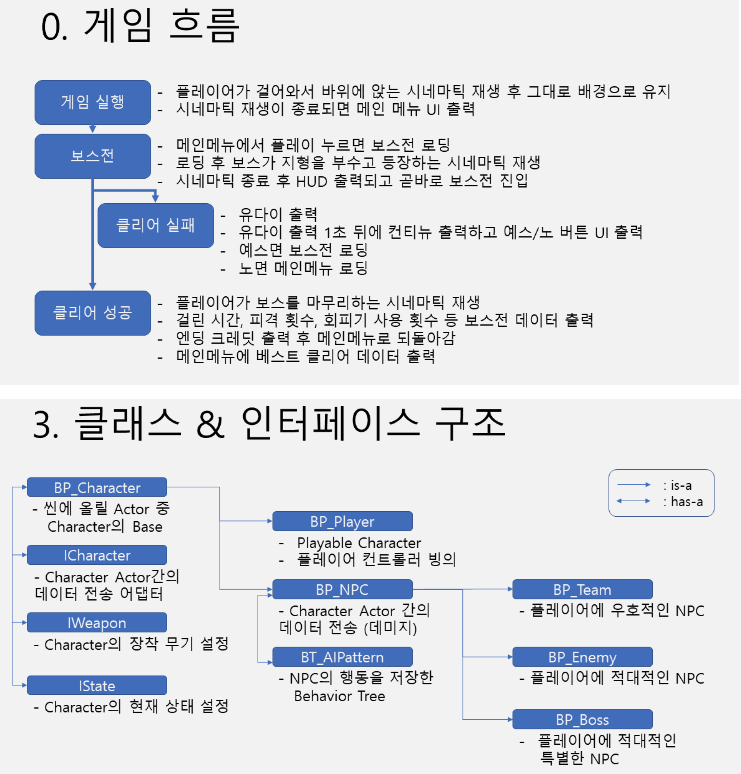
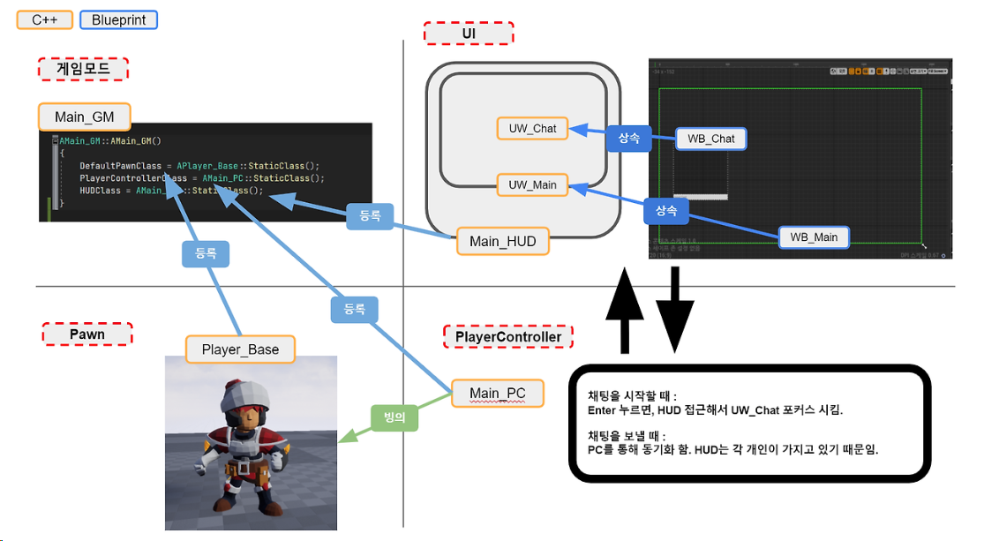

### 1. 전체적으로 이것이 어떤 게임인지에 대한 설명이 필요함
- 개발일지를 열어 보면 파악이 가능하지만 일일이 눌러서 봐야하는 불편함이 있음
- 전체적인 게임의 흐름과 진행 방식을 보여 줄 필요가 있음
- 좀 구찮아도 글을 읽어야 하는 사람들이 매우 바쁜 인간들이니 일목요연할 필요 있음
- 

### 2. 개발목표
- 이게 가장 중요한데
- 이 포트폴리오를 제작하면서 무엇을 목표로 하였는지
  > 특정 모 상용게임의 이러이러한 요소들을 구현하고자 했다<br/>
  > 혹은 요즘 게임에 이런 요소들이 많이 채용되니 이를 직접 구현해보았다 등등
- 개발을 하면서 어떤 방법에 중점을 두었는지
  > 다수의 무기를 코드의 수정 없이 관리하도록 데이터에 중점을 두었다.<br/>
  > 재사용이 가능한 컴포넌트를 작성하여 플레이어와, 적에게 공통으로 관리했다 등등
- 어떤 기술 요소를 적용했는지 알려줘야 프로그래머로써의 역량을 그들이 상상할 수 있게 해줘야 합니다.

### 3. 기술문서가 서술형으로 되어 있음
- 회사 사람들은 Addie 모형이나 도식화 된 시각 자료를 좋아합니다.
- 
- 읽어 보면 충분히 좋은 내용들입니다. 그림을 넣기에 애매한 부분들도 있지요.
- 그래도 1. 2. 3. 이런식으로 목차화를 하거나
- 단답식으로 끊어서 써주는게 좋습니다.

### 4. 마크다운 사용법은 Readme.md에서 빼주세요
- 이런 건 개인 공간으로~

### 5. 영상은 임베디드가 안된다.
- 깃허브는 안타깝게도 링크로만 유튜브 영상을 첨부할 수 있습니다.
  > 이해를 돕기 위한 AI 이미지로 만든 섬네일입니다;
- [](https://www.youtube.com/watch?v=F-v6Xz6-pf4)
```md
[](유튜브 링크)
```
