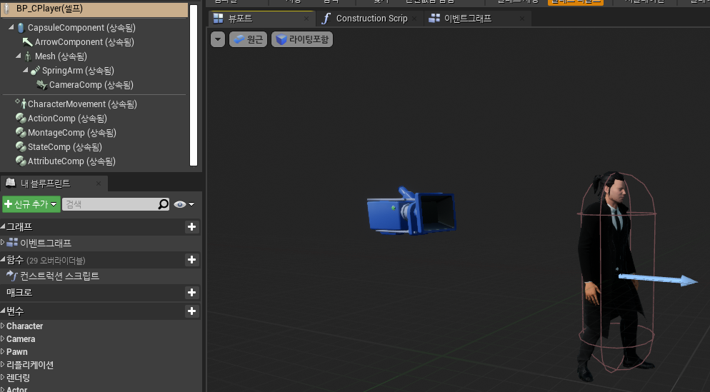
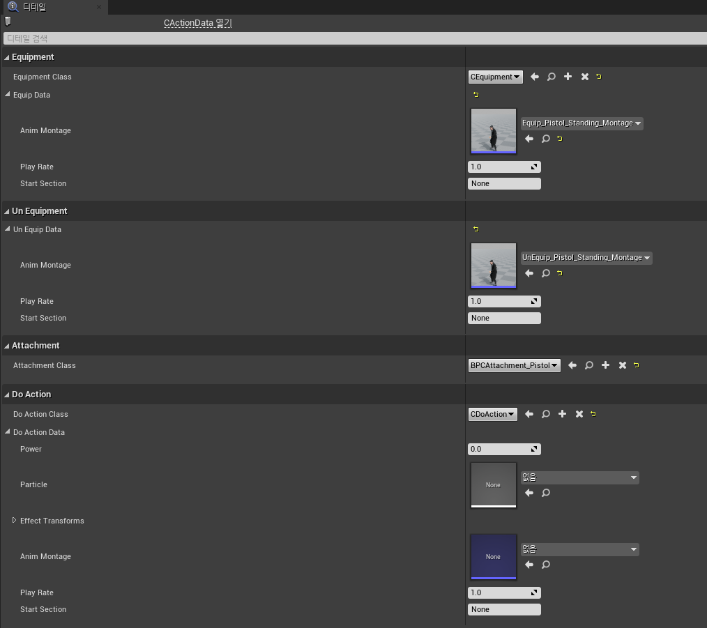
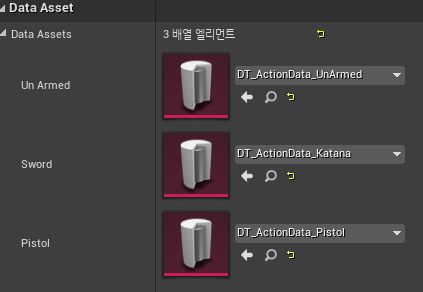
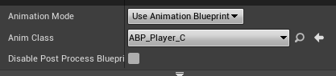
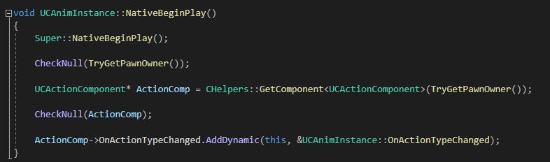
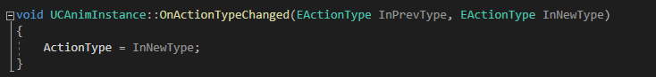
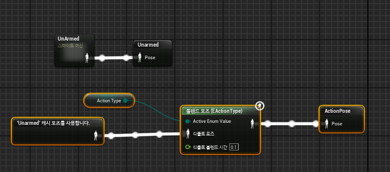
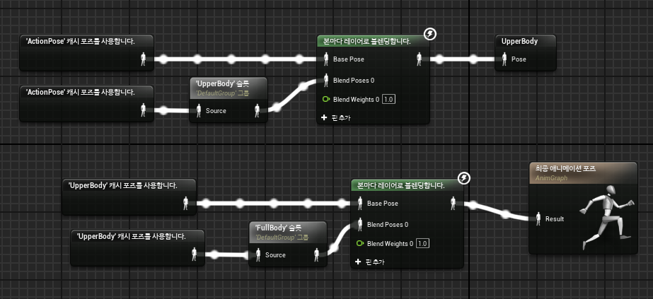

### 1주차
## 플레이어 Componenent 추가

ActionComp : 데이터 애셋을 받아 관리 하는 컴포넌트

MontageComp : 공통으로 사용 하는 Mongtage를 관리하는 컴포넌트 EX)Hit ReAction, Dead Montage

StateComp : 플레이어의 상태를 관리하는 컴포넌트 EX) Idle, Hitted, Dead

AttributeComp : 플레이어의 능력치를 관리 하는 컴포넌트 EX)HP

## ActionComp에 넣을 DataAsset
DataAsset에는 장착할 무기, 장착, 해제 시 재생되는 Montage, 공격에 대한 정보를 넣었다
이를 받기 위해서는 클래스로 받았으면 상세한 정보들은 구조체로 처리하였다

만든 DataaAsset은 플레이어에 적용해야 한다

## 플레이어 AnimInstance 적용

플레이어의 ActionComp를 가져와 어떤 무기를 장착하고 있는지에 따라 모션 변경하게 하였다.
이를 사용하기 위해 Delegate를 사용하였다.

#C++

#ABP_Player

슬롯을 Upper, FullBody로 나뉘어 상반신만 사용할 몽타주, 전신을 사용할 몽타주를 분리하였다

포즈 추가 예정

