### 2주차
## 플레이어 Pistol 발사

플레어이가 Pistol을 장착 시 공격 버튼을 누르면 총알이 나아가게 한다.  
행동은 DoAction을 상속받아 만든 DoAction_Pistol를 통해 만든다  
총알과 Particle은 ActionData에서 입력을 받아 DoAction_Pistol을 통해 Spawn한다.   

## DoAction_Pistol.CPP
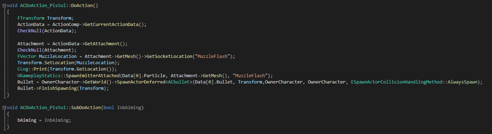  
### DoAction
공격 버튼 클릭 시 ActionData에 입력된 총알(Bullet)을 스폰한다.  
이때 스폰 할 위치는 장착 중인 Pistol의 Socket(MuzzleFlash)에 스폰을 한다.  
또한 ActionData에 입력된 Particle도 같이 스폰을 한다  

### SubDoAction
조준을 하기 위한 함수이며 눌렀을 시 포즈를 변경하기 위해 매개변수를 받는다

### 추가, 수정 예정
조준 시 위젯이 활성화 되어야 하며, 매개변수 없이 포즈가 변경이 되어야한다고 생각이 듬  
또한 Bullet이 날아가는 방향을 카메라가 바라보고 있는 방향으로 나아가게 해야 함

## CBullet
### CBullet.h
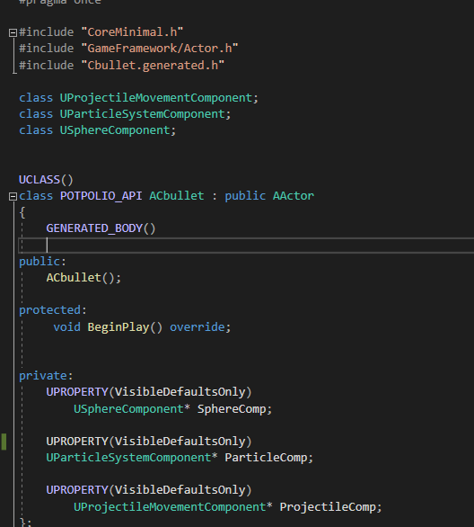

총알을 StaticMesh로 표현을 하지 않고 Particle로 표현 하였다  

### CBullet.CPP
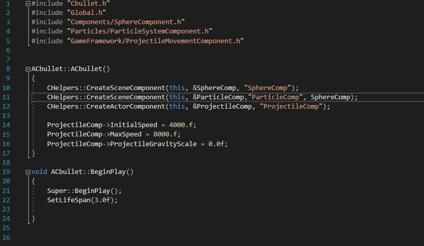  

Bullet에 관한 정보를 입력 하였다

### 추가, 수정 예정
Bullet의 충돌체 Delegate 바인드 예정

## Player
### Pistol 장착 시 포즈 변경
#### Pistol 장착 전
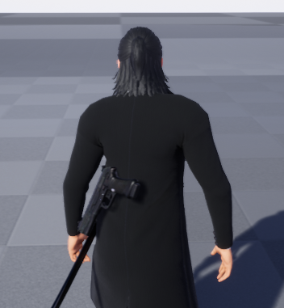

#### Pistol 장착 후
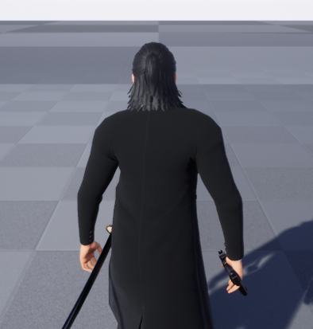  

특정 행동 후 손에 Pistol 장착

#### 조준 모션
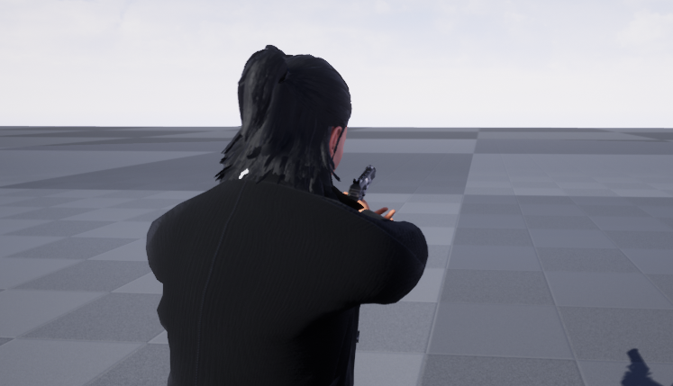  

조준 시 포즈 변경

#### Pistol 발사 시
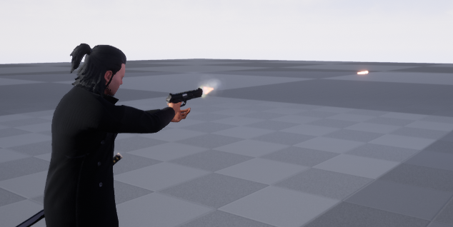

Pistol 장착 후 공격 시 Bullet, Particle 스폰 확인

## ABP_Player_
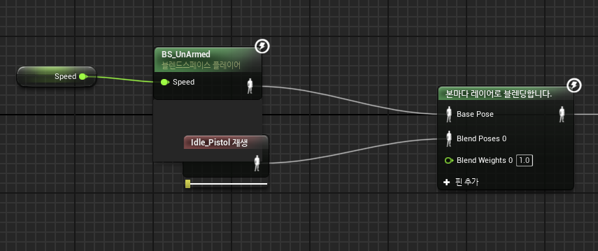  

조준 모션이 따로 없어 UnArmed 모션에 블렌딩을 하여 사용

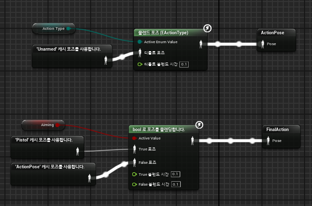  

DoAction_Pistol을 이용해 받은 bool 변수를 통해 포즈 변경

## Player.Cpp
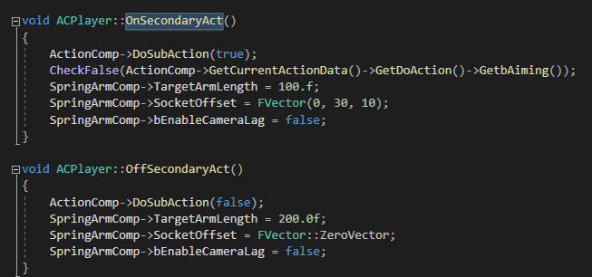  

누를 시 SpringArm과 Camera Comp 위치 이동
ActionComp의 SubAction 함수를 사용해 AnimIstance로 전달

## ActionComp-DoSubAction
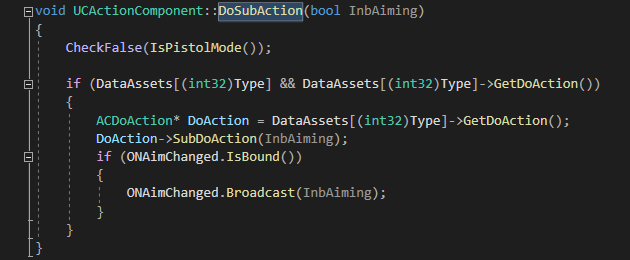  

Delegate를 이용하여 bAimng의 값을 AnimInstance에 전달한다

## AnimInstance.CPP
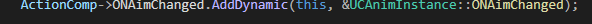  

ActionComp의 Delegate에 Bind 한다

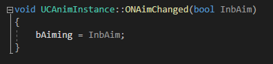  

Bind된 함수
