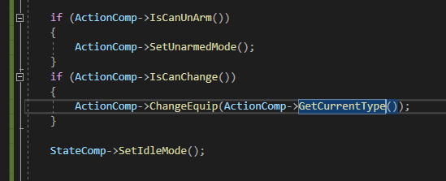

## 5주차
### 목표 
애니메이션 변경(Pistol_Idle, Sword_Euquip,UnEquip)  
DoAction_Pistol(DoAction 부분) 살짝 수정  (완)
{
회전 부분을 Trace 사용하기
}  
무기 변경 수정 - 4주차때 완료인줄 알았으나 수정이 필요함(완)
Katana_Equip,UnEquip 사운드 재생(완)  
pistol Reload, Aiming 사운드 재생 -> notify로 변경할것
적 애셋 구하기(완)

## 목표 달성도
### 총알 발사 수정
총알이 조준선에 맞지 않게 발사가 되어 이를 조준선에 맞게 수정하였다.  
카메라의 위치에서 쏘는 SweepTrace를 사용하여 날아갈 지점을 정하고  
시작점이 끝 지점을 바라보고 있는 방향을 회전값으로 받아 스폰하게 하였다

### Bullet Hit Event
총알이 Hit가 될 시 Decal을 스폰하게 하였다

사격 전  

사격 후  

### 무기 변경
무기를 변경 할 때 UnEquip 모션 실행 후 Equip모션 실행
DataAsset에 있는 Equipment에 있는 Equip, UnEquip을 사용한다  
#### ActionComponent_SetMode_
  
UnEquip 노티파이를 사용하기 위해 여러 정보를 저장한다.  
이 저장한 정보들을 노티파이에서 이용한다.  

#### UnEquipNotify
  
CanUnArmed는 상태를 UnArmed로 변경할지를 결정하고  
CanChange는 상태를 변경할지 결정한다.  

#### ActionComponent_ChangeEquip()

#### Montage 적용
  
  

#### 실행 순서
ActionComp_SetMode() -> Equipment_UnEquip() -> AnimMotifyState_UnEquip() -> AnimMotify_UnEquip() -> ActionComp_ChangeEquip() -> ActionComp_ChangeMode()

### Play Sound
노티파이 사용

### Enemy

