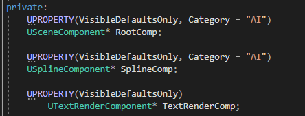
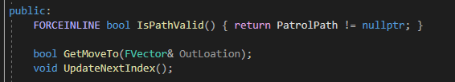
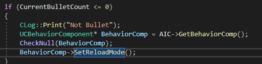
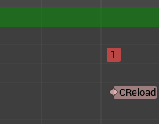
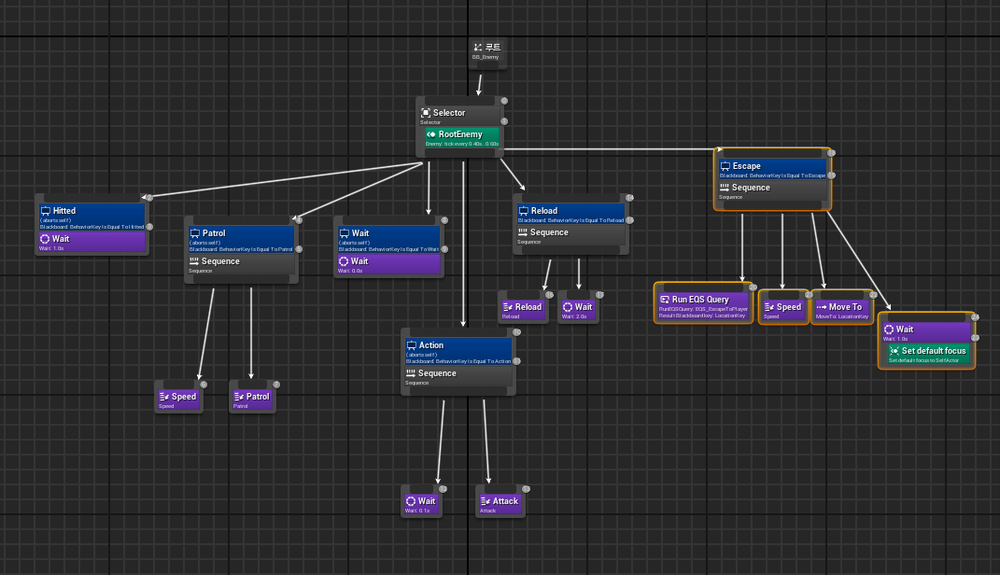

## 7주차
### 목표
1. AI가 정해진 경로 따라 이동하기 (완)
2. 가능하면 적에게 소리 감지 가능하게하기
3. 적 사망 시 총알 스폰하게 하기 (상호작용 가능)

### 달성도
#### 1. AI 경로대로 이동 -> Component 이용

순찰경로로 사용하기 위한 액터(PatrolActor)
  

이를 이용해 PatrolComponent 추가  
함수
  
경로를 따라 움직이는 함수, 순찰 지점을 업데이트를 하는 함수

#### 2. Patrol 일땐 걷는 속도로 Escape일땐 달리기
AttributeComp의 SpeedType을 받아 BehaviorTree를 통해 속도를 정한다

#### 3. 목표와는 다르게 적 재장전
총알을 다 소비했을 때 AI의 BehaviorComp를 이용하여 상태를 Reload로 변경   
   
상태가 변경이 되면서 Task 실행  
Task에서 재장전 Mongtage 실행  

Mongtage에서 노티파이를 통해 총알 재장전  

BehaviorTree   

