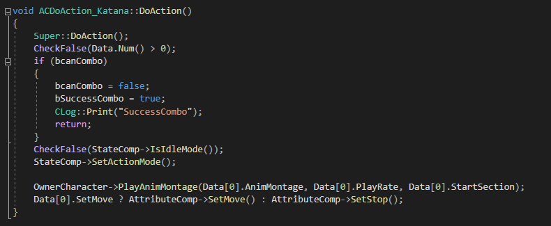

## 8주차
### 목표  
~~플레이어 검 애니메이션 넣기~~
1. 이는 플레이어의 주 모션이 될 예정  
2. ~~Equip, UnEquip, Hitted 등등 포함~~
3. ~~Equip, UnEquip 할 때 움직임 작동할 지 안 할지~~
4. 총알 스폰하기 - 상호작용 가능하게

### 달성도
1.플레이어 Sword 애니메이션 구하기, 적용  
2.플레이어 Direction  
3.Sword Equip,UnEquip 애니메이션 변경  
4.DoAction_Katana 완성 - 콤보 사용 가능  
5.Sword 상태 일 때 Shift 누르고 있을 시  대쉬 , 살짝 누를 시 뒤로 Evade  
6.적 뒤에 있을 시 StealthTakeDown 가능하게 함

### Sword  애니메이션

|이미지|애니메이션|
|________________|
| | Sword_Equip |
|| Sword_UnEquip|
|| Sword_Attack_Up|
||Sword_Attack_Down|
|| BS_Sowrd_|
||StealTakeDown|

### 대쉬
   
플레이어가 Shift 키다운 시 타이머를 사용하여 대쉬를 하게끔 하였다

### StealTakeDown
#### Enemy   
   
플레이어가 Enemy 뒤 Box Component 안에 들어가면 플레이어의 CanStealTakeDown을 True로 만든다   
   

#### Player
   
플레이어의 CanStealTakeDown이 True인지, ActionType이 Sword인지, 몽타지가 있는지 검사한다.    
   
Trace가 True일때 몽타지를 실행하면 플레이어 위치를 조정한다.  
또한 몽타지가 실행되는 동안 플레이어의 입력을 막는다.
카메라를 플레이어 앞에 스폰하여 정면에서 보게끔 한다.    

  
몽타지가 끝난 뒤면 스폰한 카메라를 삭제하고 플레이어의 움직임을 다시 활성화 한다.   

### DoAction_Katana
클릭 시 몽타지가 재생된다.  
재생되는 동안 NotifyState_Combo로 bCanCombo가 true  
true일때 클릭할 시 bSuccessCombo가 true로 변경된다
notify_BeginAction을 통해 다음 공격이 실행된다.

콤보 실패 시 상태와 콤보 카운트를 0으로 초기화한다

공격 성공(Attachment의 collision이 Overlap 됐을 때)시 CameraShake와 Particle이 재생된다

#### DoAction 

#### BeginAction
.png)
#### EndAction
.png)

### Todo
1. 파쿠르
2. 다단히트 처리
3. StealTakeDown이 아닌 콤보 후 TakeDown
4. Pistol StealTakeDown? 할 지 안 할 지 모름
5. Bullet HeadShot 적용
6. 적 처리 시 Bullet 스폰 -> 되면 MaxBullet 소모

