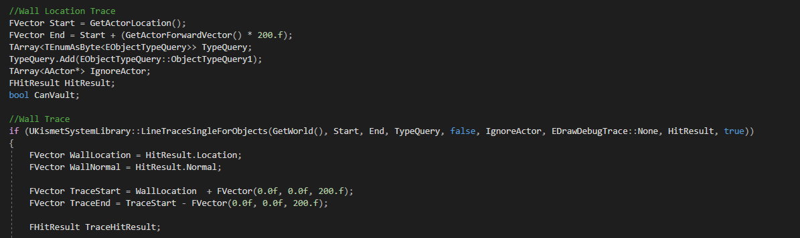
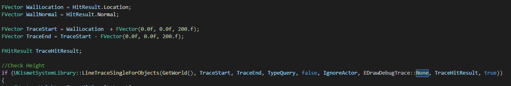
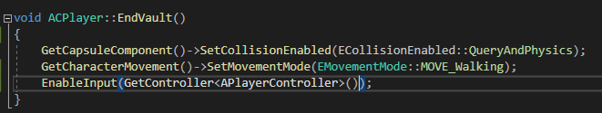
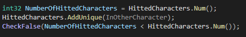
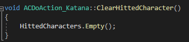
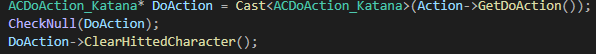
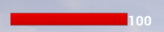

## 9주차
### 목표  
1. ~~파쿠르~~
2. ~~다단히트 처리~~
3. StealTakeDown이 아닌 콤보 후 TakeDown
4. ~~Pistol StealTakeDown? 할 지 안 할 지 모름~~ 
5. ~~Bullet HeadShot 적용~~
6. ~~적 처리 시 Bullet 스폰 -> 되면 MaxBullet 소모~~

### 달성도
#### Parkour
Tick을 통해 넘을 수 있는 벽인지 판단
1. 벽인지 판단하기
2. 넘을 수 있는 높이인지 확인
3. 벽의 깊이 확인
4. 넘을 수 있다고 판단이 되면 몽타지 재생 및 Capsule-> NoCollision, MoveMode->Flying 변경
5. 재생 후 변경 한거 원래대로 변경하기

|단계|이미지|설명|
|:---|:---:|:---|
|1||플레이어의 위치를 기준으로 2미터 앞에 충돌체가 있는지 확인한다.|
|2||확인한 위치의 2미터 상공을 기준으로 충돌한 물체의 높이를 확인한다|
|3||측정된 높이가 일정높이 이상이면 물체의 길이를 측정한다|
|4||위의 조건들이 다 만족하면 Vault Montage를 실행한다, 이에 맞게 상태도 변경한다|
|5||Montage 시간에 맞춰 다음 함수를 실행하게 **한다**|
|6||실행|

### 다단히트 처리
BeginOverlap시 HitCharacterNum을 HitCharacter의 수로 초기화,HitCharacter 배열에 추가 이 수가 배열의 크기보다 작다면 실행   
   
배열은 Collision이 꺼질 때 Empty   
DoAction_Katana   
   
CAnimNotifyState_Collision.Cpp   
     

### DoAction_Pistol HeadShot
Enemy의 CapsuleComponent의 ObjectType을 변경 (Pawn -> PhysicsBody)   
Mesh의 Collision PreSet을 변경(World 시리즈와 Camera를 제외한 모든 Collision 무시)   
변경 시 DoAction_Katana 시 튕겨지는 버그 발견->PlayerMesh도 Enemy와 같이 변경

### StealthTakeDown 추가
MontageComponent에서 이용한 DataTable을 사용하여 Montage를 관리하였다

Interface를 사용하여 Enemy, Player가 ActionType에 맞게 TakeDown을 실행하도록 하였다.
중요한 Montage는 배열로 받는다.  
이때 Crouch 상태에 따라 다른 Montage가 재생된다.  

|사진|설명|
|:---|:---|
||인터페이스 함수|
|| ActionType에 맞게 실행(Player)|
||Crouch 상태에 맞게 실행(Player)|
|__Enemy__|이하동문|

### 적 사망 시 PickUp Actor 스폰
총 장전 시 Max Bullet 소모 하게 끔 함

|사진|설명|
|:---|:---|
||장전 전|
||장전 후|
||스폰 된 PickUp_Bullet를 Overlap 할 시 MaxBullet을 증가 한다. 증가 하는 양은 랜덤|
||스폰 된 PickUp_Soju를 Overlap 할 시 Player Health을 증가 한다. 증가 하는 양은 랜덤|

스폰 하는 Actor는 블루프린트로 선택을 사용하여 랜덤으로 나오게 하였다.

### 플레이어 Health UI
   
프로그레스 바를 사용

### Todo
마무리 공격 TakeDown
게임 UI (시작 시, 사망 시, 자동 저장은 희망)

